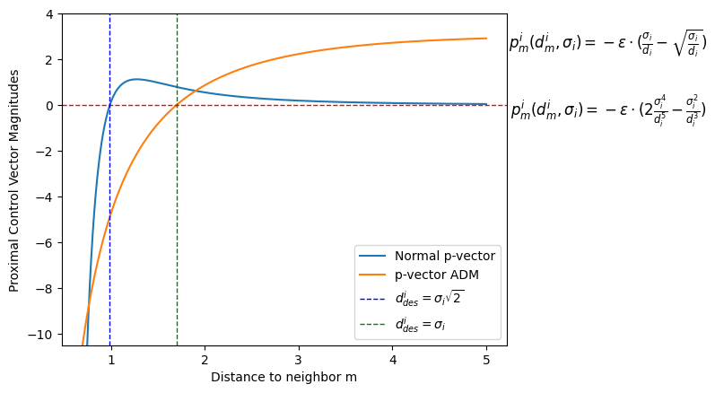
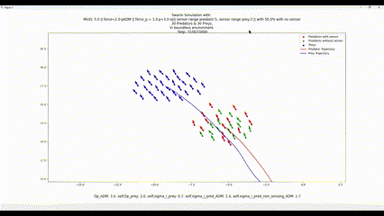

# Thesis: Sensory Heterogeneous Predator Swarm vs Fully Sensing Prey Swarm 


This repository contains a simulation environment for studying predator-prey dynamics using Active Elastice model for flocking control.



This figure shows the repulsion and atraction forces of the proximal control vector, with Attractive Distance Modulation (ADM) and Distance Modulation (DM), which allow the agents to flock.

Explanations can be found at: [Thesis presentation](https://thesis-presentation.onrender.com)


The simulation can be run with various configurations and supports both CPU and GPU execution (GPU is very slow).

Requirements
Python 3.10
Required Python packages: matplotlib, argparse, pybullet Drones, Numpy
Optional GPU (Cupy) support requires the env_gpu module and a compatible CUDA environment

Before starting run the following command:
```bash
pip install -e .
```

Usage:
Run the simulation using the following command:

```bash
python main.py [OPTIONS]
Options
--boundaries: Boundaries of the environment (default: [0,0])
--N: Number of predators (default: 10)
--N_preys: Number of preys (default: 10)
--no_sensor: Percentage of predators without sensors (default: 0.0)
--experiment_id: Experiment ID (default: "1")
--steps: Number of steps (default: 10000)
--save: Save the simulation (flag)
--sensor_range: Sensor range for predators (default: 5)
--sensing_range: Sensing range for preys (default: 3)
--draw: Draw the simulation (flag)
--no_progress_bar: Disable progress bar (flag)
--error_range: Error range (default: 0.05)
--min_distance: Minimum distance between predators and preys (default: 5.0)
--blind_spots: Enable blind spots (flag)
--draw_circles: Draw circles (flag)
--gpu: Use GPU (flag)
--pdm: Use PDM (flag)
--folder: Folder to save results (default: results)
Additional Constants
--sigma_init: Initial value of sigma (default: 1.5)
--alpha: Alpha (default: 2.0)
--beta: Beta (default: 0.0)
--gamma: Gamma (default: 0.0)
--kappa: Kappa (default: 3.0)
--alpha_prey: Alpha prey (default: 1.0)
--Dp: Dp (default: 3.0)
--sigma_i_predator: Sigma_i_predator (default: 0.7)
--sigma_i_pred_non_sensing: Sigma_i_pred_non_sensing (default: 0.75)
--sigma_i_pred_DM: Sigma_i_pred_DM (default: 1.4)
--sigma_i_pred_non_sensing_DM: Sigma_i_pred_non_sensing_DM (default: 1.7)
--Dp_prey: Dp_prey (default: 3.0)
--Dp_pm: Dp_pm (default: 3.0)
--sigma_i_prey: Sigma_i_prey (default: 0.7)
```
Example:
```bash
python main.py --N 30 --N_preys 30 --steps 10000 --save --draw --pdm
```
This command runs a simulation with 30 predators and 30 preys for 10000 steps, saves the results, and draws the simulation, with P-ADM vector for predators.

<!--  -->
<p align="center">
  
</p>

Notes
Ensure CUDA is set up if using GPU (--gpu flag).
The environment does not support drawing when using GPU.
The correct simulation is found at simulation_v2.


In the folder 3D_implementation, the simulation can be run with a physics simulator with pybullet drones. 

Navigate to Prey_Predator folder and do:
```bash
python run.py
```
The following will appear:

<!--  -->
<p align="center">
  
</p>
